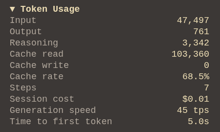

# token-usage-panel

  

 

An OpenCode plugin that adds a collapsible `Token Usage` section to the TUI session sidebar. This section shows what the session actually costs: total input/output/reasoning tokens, cache rate, spend, or speed.

Totals fold in the whole session family: the parent session plus all subagent descendants, from OpenCode's own `session.tokens` / `session.cost` aggregates. When descendants contribute, their usage sums up with parent agent usage.

## Install

_TBD, npm package not published yet._
